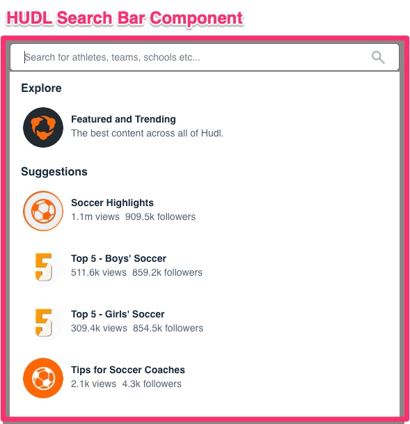
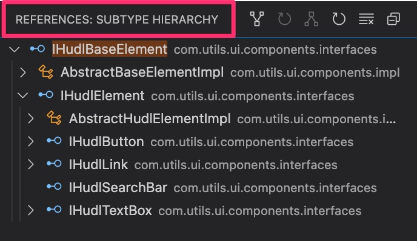
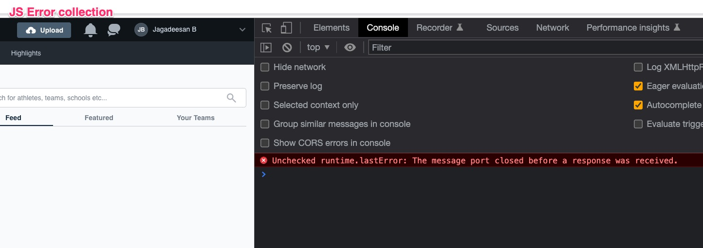

# Hudl UI Test Framework

* [Highlevel Overview](#highlevel-overview)
* [Tech Stack/Machine requirements](#Tech-Stack/Machine-requirements)
* [How to run the tests](#how-to-run-the-tests)
* [How to view test results](#how-to-view-test-results)


## Highlevel Overview
* Any typical Web development will be using components created for better reusablity eg: Angular components. Hence components can be injected in any UI pages based on its functional needs. In similar fashion the core architecture of this framework is to build Hudl UI Components & its relevant Pages on top of it. This will allow us to manage the test productivity in better way as we will develop/operate on components level as opposed to page level.

* For Example Consider the Below Hudl Search Bar Component. Assuming this is used in several pages. we can create a corresponding representation of test component like below.

* 

* A typical representation of above component would be as below.

        ```
        /**
        * This is Hudl's Search Bar component.  
        */
        public interface IHudlSearchBar extends IHudlElement {
            void search(String text);
            void selectExploreOption(String exploreOption);
            void selectSuggestion(String suggestion);
            IHudlSearchBar assertSearch(String expText);
            IHudlSearchBar assertSuggestions(List<String> expSuggestions);
        }
        ```
* **Components Hirerachy**
* 

* This library handles all the synchronization issues in a component level. Hence test need not bother about any such issues.

* This project uses Remote Webdriver from https://github.com/SeleniumHQ/docker-selenium using docker-compose we will bring up standalone server for chrome and firefox.

* Framework captures the screenshots if test fails and puts in folder /screenshots under the root of project.


## Tech Stack/Machine requirements
Framework is built on below mentioned stack. Please install the below to run the tests

* Java 1.8.0_131
* Maven 3.5.0
* Docker


## How to run the tests
* Clone the Repo
* Execute the command to run the tests

**Run UI Tests**
* You can easily execute from github codespaces. Please watch this video to run it your own githubpod. Or you can set it up in your local too by following below steps.
    - https://youtu.be/yoBh2MID0MA

* Update your system properties in `hudl-ui-framework-test/src/main/resources/config.properties`.  Please note expect password all the properties should work by default. Please update `password` before running your tests
    - baseURL=https://www.hudl.com
    - username=jagadeesan.babu@gmail.com
    - password=XXXXXX
    - browser=firefox
    - chromeserver=http://localhost:4441/wd/hub
    - firefoxserver=http://localhost:4442/wd/hub 
* command to bring the firefox and chrome standalone server : `docker-compose -f docker-compose.yml up`
* command : `mvn surefire-report:report -PUI`


**To Monitor the execution**
* launch VNC viewer
    - Chrome Execution- `https://localhost:7900`. Password as `secret`
    - FireFox Execution- `https://localhost:7901`. Password as `secret`

## How to view test results
* once the run is complete, report is generated via surefire reporting plugin and can be found under rootfolder/target/site/surefire-report.html
* launch VNC viewer
* Please see the sample run here https://youtu.be/QgC_i9S0K4c

## Next steps
* I have planned to work on below items. Due to time constraints pointing these as next steps.
 - Rest API Test & its frame work to test the backend flow.
 - Implementing JS error collection in the Method watcher class and register the error list on end of each test. Implementation will be in `MethodWatcther.Java`
 - 
 - Planned to create a docker image of this test build version.


